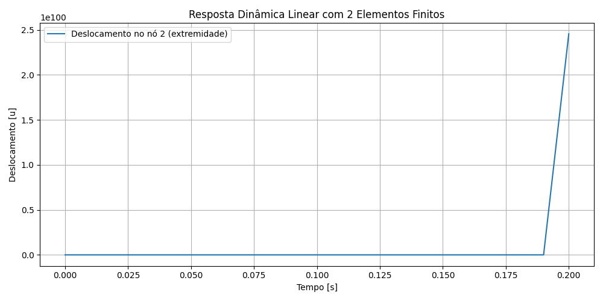

# Estruturas_VII_3
3º Relatório :books: :octocat:

## <h3 align="center"> Análise Dinâmica Implícita de uma Barra Bidimensional via Método de Newmark com Dois Elementos Finitos</h3>

**_Disciplina:_** Tópicos em Engenharia de Estruturas VII - Introdução à Análise Não Linear de Estruturas.

### **_Introdução_**

<p align="justify">A análise dinâmica de estruturas sujeitas a impacto é um tema fundamental na engenharia estrutural. Este trabalho visa aplicar o método dos elementos finitos na análise dinâmica implícita (Newmark-beta) considerando linearidade e, posteriormente, não linearidade física via método de Newton-Raphson.</p>

### **_Metodologia_**

#### **_Formulação Linear com 2 Elementos_**

 <p align="justify">Adaptou-se o algoritmo de Newmark implícito fornecido com um único elemento para uma malha com dois elementos finitos, aumentando assim a precisão da discretização espacial. As matrizes globais de rigidez e massa foram montadas a partir de suas versões locais, considerando condições de contorno fixas no nó 0.</p>

#### **_Integração no Tempo_**

<p align="justify">Foi aplicado o método de Newmark com parâmetros 𝛾=0,5 e β=0,25, que garantem estabilidade incondicional para sistemas lineares com passo de tempo constante (Bathe, 1996).</p>

#### **_Carregamento de Impacto_**

<p align="justify">Conforme discutido em aula, o carregamento na extremidade foi modelado como um impulso linear até t = 0,02s, com valor máximo de 𝑃max = 10.</p>

### **_Resultados e Discussões_**

<p align="justify">O gráfico abaixo mostra o deslocamento da extremidade livre da estrutura (nó 2), ao longo do tempo:

<div align="left"></div>

<p align="justify">Observa-se uma resposta oscilatória esperada de um sistema massa-mola, com máximos iniciais decorrentes do impacto. Quando comparado à malha com apenas um elemento, observa-se maior resolução e captação de detalhes dinâmicos, já que a discretização espacial mais refinada permite maior precisão nas deformações internas.</p>

<p align="justify">Essa diferença é atribuída à melhor resolução dos modos de vibração com múltiplos elementos (Cook et al., 2002). A deformação agora é distribuída entre dois elementos, e não concentrada em um único.</p>

### **_Conclusão_**

<p align="justify">Portanto, foi implementada a formulação dinâmica linear implícita com dois elementos finitos. Os resultados mostram que o uso de dois elementos fornece respostas mais precisas em relação ao modelo com um elemento apenas, devido à discretização mais refinada. A próxima etapa será a introdução da não linearidade física, via Newton-Raphson, conforme descrito no Passo 2 da atividade.

### **_Referências_**

```ruby
BATHE, K. J. Finite Element Procedures. 2. ed. Englewood Cliffs: Prentice-Hall, 1996.
```
```ruby
COOK, R. D.; MALKUS, D. S.; PLESHA, M. E.; WITT, R. J. Concepts and Applications of Finite Element Analysis. 4. ed. New York: Wiley, 2002.
```
```ruby
ZIENKIEWICZ, O. C.; TAYLOR, R. L. The Finite Element Method: Volume 1 – The Basis. 5. ed. Oxford: Butterworth-Heinemann, 2000.
```